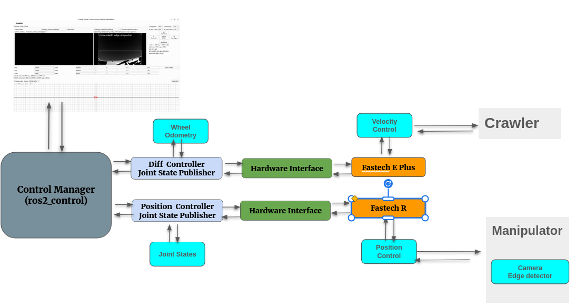

# Mobile Robot Project Manual

**Project:** ROS 2 Humble Mobile Robot with Maxon EPOS4 CANopen Drive and Fastech Motor Control  
**Document type:** Setup, wiring, installation, testing, and troubleshooting manual  
**Prepared for:** Pavetech mobile robot / welding automation development  
**Revision:** Draft v1.0  

---

## 1. Purpose of This Manual

This manual explains the current hardware-focused setup for the mobile robot project. It organizes the installation steps, CAN communication wiring, Maxon EPOS4 setup, Kvaser CAN interface setup, Fastech motor setup, manual testing commands, and common debugging procedures.

This version mainly covers the hardware and low-level communication environment. The ROS 2 application software section is kept as a preparation section and can be expanded later with package build commands, launch files, GUI operation, and robot control procedures.

---

## 2. System Overview

The project is a ROS 2 Humble based mobile robot system that uses:

| System Part | Main Device / Package | Purpose |
|---|---|---|
| Operating system | Ubuntu 22.04 recommended | Main development PC environment |
| ROS middleware | ROS 2 Humble | Robot control, topic communication, launch system |
| Robot control framework | ros2_control / ros2_controllers | Controller manager, joint interfaces, mobile base control |
| Motor controller 1 | Maxon EPOS4 | CANopen motor control |
| CAN interface | Kvaser USB-CAN device | PC-to-CAN communication |
| Motor controller 2 | Fastech EziMOTION Plus-R | RS-485 / serial motor control |
| Robot description | Xacro / URDF | Robot model and joint definition |
| Simulation / visualization | Gazebo, joint_state_publisher_gui | Simulation and joint checking |

---

## 3. Recommended Workspace Structure

The current ROS 2 workspace name is:

```text
amr_ws
```

The project source directory is:

```bash
~/amr_ws/src
```

The current project workspace contains the following main ROS 2 packages:

```text
amr_ws/
└── src/
    ├── fastech_hardware/
    │   ├── config/
    │   │   └── controllers1.yaml
    │   ├── include/
    │   │   └── fastech_hardware/
    │   │       ├── include/
    │   │       └── fastech_plus_e_system.hpp
    │   ├── launch/
    │   ├── scripts/
    │   │   ├── fastech_teleop_gu.py
    │   │   └── fastech_teleop_gui.py
    │   ├── src/
    │   │   └── fastech_plus_e_system.cpp
    │   ├── urdf/
    │   ├── CMakeLists.txt
    │   ├── fastech_hardware_plugins.xml
    │   └── package.xml
    │
    ├── fastech_hardware_rs485/
    │   ├── config/
    │   │   ├── controllers.yaml
    │   │   └── controllers1.yaml
    │   ├── include/
    │   ├── launch/
    │   ├── scripts/
    │   ├── src/
    │   │   ├── fastech_system.cpp
    │   │   └── fastech_system1.cpp
    │   ├── urdf/
    │   ├── CMakeLists.txt
    │   ├── fastech_hardware_plugins.xml
    │   └── package.xml
    │
    ├── lvs_driver/
    │
    ├── my_robot_bringup/
    │   ├── config/
    │   │   └── my_robot_controllers.yaml
    │   ├── launch/
    │   │   ├── my_robot.launch.py
    │   │   └── my_robot.launch.xml
    │   ├── CMakeLists.txt
    │   └── package.xml
    │
    └── my_robot_description/
        ├── launch/
        ├── rviz/
        ├── urdf/
        ├── CMakeLists.txt
        └── package.xml
```

Package roles:

| Package | Purpose |
|---|---|
| `fastech_hardware` | Controls the differential-drive wheel motors using the Fastech E Plus SDK. This package is used for the mobile base left/right wheel motion. The GUI node is also included in this package under the `scripts/` folder. |
| `fastech_hardware_rs485` | Controls the X, Y, and Z joints using RS-485 communication. This package is used for the manipulator or linear-axis motion. |
| `lvs_driver` | Laser vision sensor driver package. It publishes LVS profile, point, status, and related sensor data. |
| `my_robot_bringup` | Main startup package. It contains launch files and controller configuration files. |
| `my_robot_description` | Robot model package. It contains URDF/Xacro, RViz, and robot description files. |

The Maxon EPOS4 / Kvaser CAN section remains in this manual as a separate hardware communication reference.

---

## 3.1 Project ROS 2 Package Overview

This section explains the role of each project package so that a new user can understand how the complete robot system works.

### 3.1.1 Package Relationship Diagram

```text
Operator / User
      │
      ▼
GUI / Teleop Node
      │
      ├── publishes vehicle velocity command
      │        ▼
      │   diff_drive_controller
      │        ▼
      │   ros2_control hardware interface
      │        ▼
      │   motor drivers / wheel motors
      │
      ├── publishes X/Y/Z axis command
      │        ▼
      │   forward_command_controller
      │        ▼
      │   Fastech motor interface
      │        ▼
      │   linear stage motors
      │
      └── displays sensor / status data
               ▲
               │
        odometry, joint_states, LVS profile,
        filtered LVS data, motor status
```



### 3.1.2 Main Project Packages

| Package Name | Main Role | What a New User Should Know |
|---|---|---|
| `my_robot_description` | Robot model package | Contains URDF/Xacro files that describe the robot frame, wheels, joints, links, sensors, and visual geometry. |
| `my_robot_bringup` | Main startup package | Contains launch files and configuration files. This is usually the package that the user launches first. |
| `fastech_hardware` | Differential wheel control package | Controls the mobile robot left/right wheel motors using the Fastech E Plus SDK. It is connected to the differential-drive controller side. |
| `fastech_hardware_rs485` | X/Y/Z joint control package | Controls the X, Y, and Z joints through RS-485. It is used for the manipulator/linear-axis motion. |
| `lvs_driver` | Laser vision sensor driver package | Publishes raw laser profile data from the LVS sensor. Usually publishes topics such as `/lvs/profile`, `/lvs/points`, and `/lvs/status`. |
| Maxon EPOS4 / Kvaser CAN reference | Separate hardware reference section | The Maxon part is kept as a separate manual section for CANopen setup, Kvaser setup, and EPOS4 testing. |

---

### 3.1.3 What Each Package Does

#### A. Robot Description Package

Typical package name:

```text
my_robot_description
```

Main contents:

```text
my_robot_description/
├── urdf/
│   └── my_robot.urdf.xacro
├── meshes/
├── rviz/
└── CMakeLists.txt or package.xml
```

Purpose:

- Defines the robot body frame.
- Defines left and right wheel joints.
- Defines X/Y/Z manipulator axes if included in the same robot model.
- Defines sensor frames such as camera frame, LVS frame, IMU frame, or tool frame.
- Provides the `robot_description` parameter to `robot_state_publisher`.

Important output:

```text
/robot_description
/tf
/tf_static
/joint_states
```

---

#### B. Bringup Package

Typical package name:

```text
my_robot_bringup
```

Main contents:

```text
my_robot_bringup/
├── launch/
│   └── my_robot.launch.py
├── config/
│   └── my_robot_controllers.yaml
└── package.xml
```

Purpose:

- Starts the full robot system.
- Loads the URDF/Xacro model.
- Starts `robot_state_publisher`.
- Starts `ros2_control_node`.
- Loads the controller YAML file.
- Spawns controllers such as:
  - `joint_state_broadcaster`
  - `diff_drive_controller`
  - `x_axis_controller`
  - `y_axis_controller`
  - `z_axis_controller`
- Optionally starts the GUI, LVS driver, LVS filter, or sensor nodes.

Typical command:

```bash
ros2 launch my_robot_bringup my_robot.launch.py
```

Important output:

```text
/controller_manager
/diff_drive_controller/cmd_vel
/diff_drive_controller/odom
/joint_states
/tf
```

---

#### C. Control / GUI Package

The current screenshot does not show a separate GUI/control package. If a GUI node is added later, it can be placed in a separate package such as:

```text
my_robot_control
```

or inside an existing package under a `scripts/` directory.

Purpose of the GUI/control node:

- Provides the operator GUI.
- Sends vehicle movement commands.
- Sends X/Y/Z axis jog commands.
- Shows robot status, motor status, LVS profile, and filtered profile.
- Converts operator-friendly units such as:
  - `cm/s`
  - `cm/min`
  - `deg/min`
  - `mm/min`

Typical vehicle command topic:

```text
/diff_drive_controller/cmd_vel
```

Typical axis command topics:

```text
/x_axis_controller/commands
/y_axis_controller/commands
/z_axis_controller/commands
```

---

#### D. Fastech Hardware Package for Differential Wheels

Package name:

```text
fastech_hardware
```

Main files shown in the current project tree:

```text
fastech_hardware/include/fastech_hardware/fastech_plus_e_system.hpp
fastech_hardware/src/fastech_plus_e_system.cpp
fastech_hardware/scripts/fastech_teleop_gui.py
fastech_hardware/config/controllers1.yaml
fastech_hardware/fastech_hardware_plugins.xml
```

Purpose:

- Controls the differential-drive wheel motors.
- Uses the Fastech E Plus SDK.
- Receives wheel commands from the ROS 2 controller layer.
- Converts ROS 2 wheel velocity commands into Fastech motor driver commands.
- This package is mainly related to the mobile base motion: forward, reverse, left turn, right turn, and stop.
- The GUI node is included in the `scripts/` folder of this same package.

Typical controller relationship:

```text
fastech_teleop_gui.py
        ▼
/diff_drive_controller/cmd_vel
        ▼
diff_drive_controller
        ▼
fastech_hardware
        ▼
Fastech E Plus SDK
        ▼
Left / Right wheel motors
```

Typical files:

```text
fastech_hardware/
├── config/controllers1.yaml
├── include/fastech_hardware/fastech_plus_e_system.hpp
├── scripts/fastech_teleop_gui.py
├── src/fastech_plus_e_system.cpp
├── fastech_hardware_plugins.xml
├── CMakeLists.txt
└── package.xml
```

---

#### E. Fastech Hardware Lifecycle Operation

The `fastech_hardware` package works as a `ros2_control` hardware plugin. In ROS 2 control, the hardware is not simply started as a normal topic node. Instead, it is loaded by the `controller_manager` and controlled through lifecycle-style hardware callbacks.

The important concept is:

```text
Launch file
   ▼
robot_description / URDF
   ▼
ros2_control_node / controller_manager
   ▼
pluginlib loads fastech_hardware plugin
   ▼
Hardware lifecycle callbacks run
   ▼
Controllers send commands
   ▼
read() / write() loop controls real motors
```

### E.1 Hardware Plugin Loading

The hardware plugin is registered in:

```text
fastech_hardware/fastech_hardware_plugins.xml
```

The CMake and package files export this plugin so that `controller_manager` can load it.

Typical loading flow:

| Step | What Happens |
|---:|---|
| 1 | `my_robot.launch.py` starts `ros2_control_node`. |
| 2 | The robot URDF is loaded through `robot_description`. |
| 3 | The URDF contains a `<ros2_control>` hardware plugin name. |
| 4 | `controller_manager` searches the plugin from `fastech_hardware_plugins.xml`. |
| 5 | `fastech_plus_e_system.cpp` is loaded as the actual hardware interface. |
| 6 | Lifecycle callbacks such as `on_init`, `on_configure`, and `on_activate` are called. |

---

### E.2 ros2_control Hardware Lifecycle Sequence

The normal lifecycle sequence is:

```text
on_init()
   ▼
on_configure()
   ▼
on_activate()
   ▼
read()  ─┐
write() ─┘ repeated continuously during control loop
   ▼
on_deactivate()
   ▼
on_cleanup() / shutdown
```

Simple meaning:

| Function | Simple Meaning | Main Job in This Project |
|---|---|---|
| `on_init()` | Read basic hardware information | Read joint names, parameters, motor IDs, conversion values, and prepare variables. |
| `on_configure()` | Prepare hardware connection | Initialize the Fastech E Plus SDK, open communication, check motor driver connection, and prepare the system. |
| `on_activate()` | Start real control | Enable servo, reset command/state values, clear alarms if required, and make motors ready to move. |
| `read()` | Read motor feedback | Read actual wheel position, velocity, and status from the Fastech drivers and update ROS 2 state interfaces. |
| `write()` | Send motor command | Receive commands from ROS 2 controllers and send velocity/stop commands to the Fastech E Plus SDK. |
| `on_deactivate()` | Stop real control safely | Stop motors, disable movement command, and optionally servo off. |
| `on_cleanup()` | Release resources | Close communication and reset internal variables if implemented. |
| `on_shutdown()` | Final shutdown | Stop motors and close communication during program exit if implemented. |
| `on_error()` | Error handling | Stop motors and protect the system if a serious error happens if implemented. |

---

### E.3 `on_init()` Explanation

`on_init()` is called first when the hardware plugin is created.

This function should not move the motor. It should only prepare the internal software values.

Typical jobs:

- Read hardware information from URDF.
- Check the number of joints.
- Read joint names, for example:

```text
left_wheel_joint
right_wheel_joint
```

- Prepare state variables:

```text
position
velocity
```

- Prepare command variables:

```text
velocity command
```

- Read hardware parameters such as:

```text
motor ID
gear ratio
wheel radius
port name
baudrate
counts per revolution
```

Expected result:

```text
Hardware object is created, but motors are not moving yet.
```

---

### E.4 `on_configure()` Explanation

`on_configure()` is called when the hardware is moved into the configured state.

This is usually where the real hardware connection is prepared.

Typical jobs for `fastech_hardware`:

- Load or initialize the Fastech E Plus SDK.
- Open communication to the Fastech motor drivers.
- Check if the motor drivers are connected.
- Check motor IDs.
- Check driver status.
- Prepare position and velocity variables.
- Do not start motion yet.

Expected result:

```text
Fastech communication is ready, but robot is not actively moving yet.
```

If connection fails, the hardware should return an error so the controller does not start with unsafe hardware.

---

### E.5 `on_activate()` Explanation

`on_activate()` is called when the hardware becomes active.

This is the stage where the motors become ready to receive real commands.

Typical jobs:

- Reset command values to zero.
- Reset state values if needed.
- Clear motor alarm if required.
- Enable servo if the drive requires servo ON.
- Prepare safe zero-speed output.
- Confirm that both left and right wheel motors are ready.

Expected result:

```text
Robot is ready to move when the controller sends velocity commands.
```

Important safety point:

```text
on_activate() should not suddenly move the robot.
```

It should prepare the motor but keep command speed at zero until the controller sends a command.

---

### E.6 `read()` Explanation

`read()` is called repeatedly by `controller_manager` during the control loop.

This function transfers real motor feedback into ROS 2.

Typical jobs:

- Read actual motor position from Fastech drive.
- Read actual motor velocity from Fastech drive.
- Read alarm or status bits if implemented.
- Convert motor-side values into ROS-side values.
- Update state interfaces for each wheel joint.

Concept:

```text
Fastech driver feedback
        ▼
read()
        ▼
ROS 2 state interfaces
        ▼
/joint_states
        ▼
odometry / GUI / diagnostics
```

Example state information:

| State | Meaning |
|---|---|
| Wheel position | Used for odometry and joint state publishing |
| Wheel velocity | Used for controller feedback and status display |
| Motor status | Used for error checking and GUI status |

Important note:

```text
read() does not send motion commands.
```

It only reads the current hardware state.

---

### E.7 `write()` Explanation

`write()` is also called repeatedly by `controller_manager` during the control loop.

This function transfers ROS 2 controller commands to the real motor driver.

Typical jobs:

- Receive target wheel velocity from `diff_drive_controller`.
- Convert ROS units to Fastech driver units.
- Send velocity commands to left and right wheel motors through the Fastech E Plus SDK.
- Send stop command when target velocity is zero.
- Protect the motor if command is outside limit.

Concept:

```text
diff_drive_controller command
        ▼
ROS 2 command interfaces
        ▼
write()
        ▼
Fastech E Plus SDK command
        ▼
Left / right wheel motors
```

Typical command conversion:

| ROS Side | Hardware Side |
|---|---|
| rad/s wheel velocity | motor rpm, pulse speed, or driver velocity unit |
| positive velocity | forward motor direction |
| negative velocity | reverse motor direction |
| zero velocity | stop command |

Important note:

```text
write() is where the real motor command is sent.
```

If the robot moves in the wrong direction, the direction sign or left/right motor mapping should be checked in this stage.

---

### E.8 `on_deactivate()` Explanation

`on_deactivate()` is called when the hardware is stopped or controllers are deactivated.

Typical jobs:

- Send stop command to left and right wheel motors.
- Set command value to zero.
- Disable motion output.
- Optionally turn servo OFF depending on the safety design.
- Keep communication open or close it depending on implementation.

Expected result:

```text
Robot stops safely and no further motion command is sent.
```

---

### E.9 Control Loop Timing

The control loop is usually defined by the controller manager update rate in the YAML file.

Example:

```yaml
controller_manager:
  ros__parameters:
    update_rate: 50
```

If `update_rate` is 50 Hz:

```text
read() and write() are called about 50 times per second.
```

Control loop concept:

```text
Every cycle:
1. read actual wheel state
2. controller calculates required command
3. write command to motor driver
4. repeat
```

---

### E.10 Relationship Between GUI and Hardware Lifecycle

The GUI node in:

```text
fastech_hardware/scripts/fastech_teleop_gui.py
```

is not the same as the hardware lifecycle plugin.

The GUI only publishes ROS commands. It does not directly run `on_configure()`, `on_activate()`, `read()`, or `write()`.

Relationship:

```text
GUI button pressed
      ▼
GUI publishes /diff_drive_controller/cmd_vel
      ▼
diff_drive_controller receives command
      ▼
controller_manager calls write()
      ▼
fastech_hardware sends command to motor
```

This means:

| Part | Job |
|---|---|
| GUI | User interface and command publisher |
| `diff_drive_controller` | Converts robot velocity into wheel velocity |
| `fastech_hardware` | Sends real command to Fastech wheel motor drivers |
| Fastech E Plus SDK | Low-level motor driver communication |

---

### E.11 Full Differential Wheel Control Flow

```text
Operator presses Forward button
        ▼
fastech_teleop_gui.py publishes velocity command
        ▼
/diff_drive_controller/cmd_vel
        ▼
diff_drive_controller calculates wheel velocity
        ▼
command interface is updated
        ▼
fastech_hardware::write() is called
        ▼
Fastech E Plus SDK sends command
        ▼
Left and right wheels rotate forward
        ▼
fastech_hardware::read() reads feedback
        ▼
/joint_states and /odom are updated
        ▼
GUI/status display can show robot movement
```

---

### E.12 Common Lifecycle States

| Lifecycle State | Meaning in This Project |
|---|---|
| `unconfigured` | Hardware plugin exists but communication is not ready. |
| `inactive` | Hardware is configured but not actively sending motion commands. |
| `active` | Hardware is ready and `read()` / `write()` are running. |
| `finalized` | Hardware is shut down. |
| `error` | Hardware failed and should stop safely. |

---

### E.13 Useful Lifecycle / Controller Check Commands

List controllers:

```bash
ros2 control list_controllers
```

List hardware components:

```bash
ros2 control list_hardware_components
```

List hardware interfaces:

```bash
ros2 control list_hardware_interfaces
```

Deactivate a controller:

```bash
ros2 control switch_controllers --deactivate diff_drive_controller
```

Activate a controller:

```bash
ros2 control switch_controllers --activate diff_drive_controller
```

Check if command topic exists:

```bash
ros2 topic list | grep cmd_vel
```

Echo command topic:

```bash
ros2 topic echo /diff_drive_controller/cmd_vel
```

---

### E.14 Typical Problems Related to Lifecycle

| Problem | Likely Cause | Check / Solution |
|---|---|---|
| Controller is loaded but not active | Controller was not activated by launch file | `ros2 control list_controllers` |
| `subscriber is inactive` warning | `diff_drive_controller` is not active | Activate controller or fix launch sequence |
| Motor does not move although GUI publishes command | Hardware plugin not active or `write()` not sending command | Check controller and hardware state |
| Odometry does not update | `read()` is not updating wheel position/velocity | Check Fastech feedback reading logic |
| Robot moves opposite direction | Motor direction sign or joint mapping is wrong | Check `write()` conversion and left/right mapping |
| Robot moves suddenly after launch | Old command value not reset | Set command values to zero in `on_activate()` |
| Stop button does not stop motor | Zero command not converted to stop command | Check `write()` zero-speed handling |

---

#### F. Fastech RS-485 Hardware Package for X/Y/Z Joints

Package name:

```text
fastech_hardware_rs485
```

Main files shown in the current project tree:

```text
fastech_hardware_rs485/src/fastech_system.cpp
fastech_hardware_rs485/src/fastech_system1.cpp
```

Purpose:

- Controls the X, Y, and Z joints.
- Uses RS-485 communication.
- Sends axis jog, velocity, stop, servo, and alarm reset commands.
- This package is mainly related to manipulator or linear-stage motion, not the wheel base.

Typical controller relationship:

```text
/x_axis_controller/commands
/y_axis_controller/commands
/z_axis_controller/commands
        ▼
forward_command_controller
        ▼
fastech_hardware_rs485
        ▼
RS-485 communication
        ▼
X / Y / Z axis motors
```

Typical files:

```text
fastech_hardware_rs485/
├── config/controllers.yaml
├── config/controllers1.yaml
├── src/fastech_system.cpp
├── src/fastech_system1.cpp
├── fastech_hardware_plugins.xml
├── CMakeLists.txt
└── package.xml
```

Recommended serial device:

```text
/dev/fastech_rs485
```

or:

```text
/dev/ttyUSB0
/dev/ttyUSB1
```

---

#### F. Maxon EPOS Hardware Package

Typical package name:

```text
maxon_epos_hardware
```

Purpose:

- Communicates with Maxon EPOS4 motor controller.
- Uses CANopen over Kvaser USB-CAN.
- Controls drive enable, fault reset, target velocity, and stop.
- Can be tested manually by `cansend` before connecting to ROS 2.

Typical CAN interface:

```text
can0
```

Typical bitrate:

```text
1000000
```

Typical EPOS4 node IDs:

```text
Node 1 → CANopen COB-ID 601
Node 2 → CANopen COB-ID 602
```

---

#### G. LVS Driver Package

Typical package name:

```text
lvs_driver
```

Purpose:

- Receives laser profile data from the Laser Vision Sensor.
- Publishes profile data to ROS 2 topics.
- Provides raw profile information for visualization, filtering, and seam tracking.

Typical topics:

```text
/lvs/profile
/lvs/points
/lvs/status
/lvs/corners
```

Typical message example:

```text
lvs_driver/msg/LvsProfile
```

---

#### H. LVS Filter Package

Typical package name:

```text
lvs_pipeline_filter
```

Purpose:

- Subscribes to the raw LVS profile.
- Removes noise and unstable points.
- Applies smoothing or filtering.
- Publishes filtered profile data for GUI display or seam tracking.

Typical input:

```text
/lvs/profile
```

Typical output:

```text
/lvs/profile_filtered
```

---

### 3.1.4 Recommended Full System Topic Flow

```text
[GUI / Teleop]
      │
      ├── /diff_drive_controller/cmd_vel
      │          ▼
      │   [diff_drive_controller]
      │          ▼
      │   [wheel motor hardware]
      │
      ├── /x_axis_controller/commands
      ├── /y_axis_controller/commands
      └── /z_axis_controller/commands
                 ▼
          [Fastech axis hardware]

[LVS Sensor]
      │
      ▼
/lvs/profile
      │
      ▼
[LVS Filter Node]
      │
      ▼
/lvs/profile_filtered
      │
      ▼
[GUI Display / Tracking Node]
```

### 3.1.5 Minimum Launch Order for New Users

A new user should start the project in this order:

| Step | Command / Action | Purpose |
|---:|---|---|
| 1 | Connect all hardware | Motor drivers, CAN adapter, RS-485 adapter, sensors |
| 2 | Bring up CAN | Make sure `can0` is available |
| 3 | Check serial devices | Make sure Fastech `/dev/fastech_rs485` or `/dev/ttyUSB*` exists |
| 4 | Source ROS 2 | Load ROS 2 Humble environment |
| 5 | Source workspace | Load project packages |
| 6 | Launch bringup | Start robot model and controllers |
| 7 | Check controllers | Confirm controllers are active |
| 8 | Start GUI | Control robot and monitor status |
| 9 | Start LVS nodes | Visualize raw and filtered profile data |

Example:

```bash
source /opt/ros/humble/setup.bash
cd ~/mobile_robot_ws
source install/setup.bash
ros2 launch my_robot_bringup my_robot.launch.py
```

Check controllers:

```bash
ros2 control list_controllers
```

Check topics:

```bash
ros2 topic list
```

---

## 4. Base ROS 2 Package Installation

Install the required ROS 2 packages.

```bash
sudo apt update
```

### 4.1 Install ROS 2 Control

```bash
sudo apt-get install ros-humble-ros2-control
```

### 4.2 Install ROS 2 Controllers

```bash
sudo apt-get install ros-humble-ros2-controllers
```

### 4.3 Install Xacro

```bash
sudo apt-get install ros-humble-xacro
```

### 4.4 Install Gazebo ROS Packages

```bash
sudo apt-get install ros-humble-ros-gz*
```

### 4.5 Install Gazebo ROS 2 Control

```bash
sudo apt-get install ros-humble-*-ros2-control
```

### 4.6 Install Joint State Publisher GUI

```bash
sudo apt-get install ros-humble-joint-state-publisher-gui
```

### 4.7 Install Turtlesim

```bash
sudo apt-get install ros-humble-turtlesim
```

### 4.8 Install Robot Localization

```bash
sudo apt-get install ros-humble-robot-localization
```

### 4.9 Install Joystick Package

```bash
sudo apt-get install ros-humble-joy
```

### 4.10 Install TF Transformations

```bash
sudo apt-get install ros-humble-tf-transformations
```

### 4.11 Install Python `transforms3d`

```bash
pip install transforms3d
```

> Note: The correct package name is `transforms3d`.

---

## 5. Maxon EPOS4 CAN Communication

## 5.1 Hardware Components

| Item | Description |
|---|---|
| EPOS4 controller | Maxon motor controller |
| Kvaser USB-CAN interface | CAN adapter connected to Linux PC |
| CAN cable | CANH, CANL, GND, shield connection |
| Motor power supply | Power source for EPOS4 and motor |
| Termination resistor | 120 Ω CAN termination at bus ends |

---

## 5.2 EPOS4 CAN Wiring

Connect the EPOS4 controllers and Kvaser interface using CAN wiring.

| Signal | EPOS4 Wire Color | Kvaser D-SUB Pin | Description |
|---|---:|---:|---|
| CANH | White | Pin 7 | CAN High |
| CANL | Brown | Pin 2 | CAN Low |
| GND | Green | Pin 3 | Signal ground |
| Shield | Shield wire | Pin 5 | Cable shield |

Basic connection rule:

```text
EPOS4 CANH  → Kvaser CANH
EPOS4 CANL  → Kvaser CANL
EPOS4 GND   → Kvaser GND
EPOS4 Shield → Kvaser Shield
```

If two EPOS4 controllers are used, connect them on the same CAN bus:

```text
PC / Kvaser CAN ── EPOS4 Node 1 ── EPOS4 Node 2
```

---

## 5.3 EPOS4 Node ID Setting

Set the EPOS4 node ID using the DIP switches.

| Controller | Node ID | DIP Switch Example |
|---|---:|---|
| EPOS4 controller 1 | 1 | Switch 1 ON |
| EPOS4 controller 2 | 2 | Switch 2 ON |

After changing DIP switches, power-cycle the controller to make sure the node ID is applied.

---

## 5.4 CAN Termination Resistor

Turn on the CAN termination resistor at the ends of the CAN bus.

In the current hardware note, DIP switch 7 is used to enable the termination resistor on the EPOS4 controller.

Recommended CAN bus rule:

| CAN Bus Length / Structure | Termination Rule |
|---|---|
| One bus line | 120 Ω at both physical ends |
| EPOS4 at both ends | Enable termination on both end controllers |
| Kvaser in the middle | Do not terminate in the middle |
| Communication unstable | Check CANH/CANL polarity and termination first |

---

## 6. Kvaser Driver and CAN Setup

## 6.1 Install Build Tools

```bash
sudo apt-get install build-essential
sudo apt-get install linux-headers-$(uname -r)
sudo apt-get install pkg-config
```

---

## 6.2 Install Kvaser LinuxCAN Driver

Download the Kvaser SDK / LinuxCAN driver from the Kvaser website.

After downloading and extracting the driver:

```bash
cd linuxcan
make
sudo make install
sudo make load
```

If the SDK includes a `linuxcan-5.50-source-only.dkms` or DKMS source tree, install it as follows:

```bash
sudo make
sudo make install
```

---

## 6.3 Install Kvaser CANlib SDK

```bash
wget --content-disposition "https://www.kvaser.com/downloads-kvaser/?utm_source=software&utm_ean=7330130981966&utm_status=latest"
tar xvzf kvlibsdk.tar.gz
cd kvlibsdk
sudo make
sudo make install
sudo modprobe kvaser_usb
```

> Note: The correct command is `modprobe`, not `mod_probe`.

---

## 6.4 Remove Virtual CAN Driver if Needed

Sometimes the Kvaser LinuxCAN stack can conflict with SocketCAN. Remove `kvvirtualcan` if needed:

```bash
sudo modprobe -r kvvirtualcan
```

Then reboot:

```bash
sudo reboot
```

---

## 6.5 Check CAN Interface

After reboot, check whether `can0` appears:

```bash
ip link show
```

Expected result:

```text
can0: <NOARP,ECHO> ...
```

If `can0` does not appear, follow the recovery procedure below.

---

## 7. Recovery Procedure When `can0` Does Not Appear

## 7.1 Unload Existing CAN / Kvaser Modules

```bash
sudo modprobe -r kvvirtualcan
sudo modprobe -r leaf
sudo modprobe -r kvcommon
sudo modprobe -r kvaser_usb
```

If any module is in use, unplug the Kvaser USB cable and try again.

---

## 7.2 Load SocketCAN Base Modules

```bash
sudo modprobe can
sudo modprobe can_raw
sudo modprobe can_dev
```

---

## 7.3 Load Kvaser USB SocketCAN Driver

```bash
sudo modprobe kvaser_usb
lsmod | grep kvaser
```

---

## 7.4 Replug Kvaser USB and Check Again

```bash
ip link show
```

---

## 7.5 Bring CAN Interface Up

For 1 Mbps CAN communication:

```bash
sudo ip link set can0 up type can bitrate 1000000
sudo ip link set can1 up type can bitrate 1000000
```

Check the detailed status:

```bash
ip -details link show can0
```

---

## 8. Manual CAN Communication Test

## 8.1 Bring Up `can0`

```bash
sudo ip link set can0 up type can bitrate 1000000
```

---

## 8.2 Verify CAN Interface

```bash
ip link show can0
```

---

## 8.3 Start CAN Monitor

Open terminal 1:

```bash
candump can0
```

---

## 8.4 Send EPOS4 CANopen Commands

Open terminal 2 and send the following commands.

### Step 1: Set Mode to Profile Velocity

```bash
cansend can0 601#2F60600003000000
cansend can0 602#2F60600003000000
```

### Step 2: Clear Faults

```bash
cansend can0 601#2F60600080000000
cansend can0 602#2F60600080000000
```

### Step 3: Shutdown

```bash
cansend can0 601#2B40600006000000
cansend can0 602#2B40600006000000
```

### Step 4: Switch On

```bash
cansend can0 601#2B4060000F000000
cansend can0 602#2B4060000F000000
```

### Step 5: Enable Operation

```bash
cansend can0 601#2B4060001F000000
cansend can0 602#2B4060001F000000
```

### Step 6: Set Target Velocity

Example target velocity: 20,000 rpm.

```bash
cansend can0 601#23FF6000204E0000
cansend can0 602#23FF6000204E0000
```

### Step 7: Wait 2 Seconds

```bash
sleep 2
```

### Step 8: Stop Motor

```bash
cansend can0 601#2B40600000000000
cansend can0 602#2B40600000000000
```

> Important: In the original command note, the stop command for node 1 was repeated twice. For two controllers, stop node 1 and node 2 separately using COB-IDs `601` and `602`.

---

## 9. Maxon EPOS4 Linux Library Setup

## 9.1 Install EPOS Linux Library

Navigate to the EPOS Linux Library directory:

```bash
cd /EPOS-Linux-Library-En/EPOS_Linux_Library
sudo bash ./install.sh
```

---

## 9.2 Build Example Programs

Navigate to the examples directory and build:

```bash
make
```

---

## 9.3 Example Default Parameters

The C++ parameter setup should match the actual CAN interface.

Example:

```cpp
void SetDefaultParameters()
{
    g_usNodeId = 1;
    g_deviceName = "EPOS4";
    g_protocolStackName = "CANopen";
    g_interfaceName = "CAN_kvaser_usb 0";
    g_portName = "CAN0";
    g_baudrate = 1000000;
}
```

---

## 9.4 Check Available Interface Names

If the correct interface name, port name, or protocol stack name is unknown, run:

```bash
./HelloEposCmd -l
```

---

## 9.5 Run EPOS Example

```bash
./HelloEposCmd
```

If the motor responds, the EPOS4 library and CAN communication are working.

---

## 10. EPOS4 / Kvaser Debugging Procedure

## 10.1 Reload Kvaser Driver

```bash
sudo modprobe -r kvaser_usb
sudo modprobe kvaser_usb
sudo dmesg | grep -i kvaser
```

---

## 10.2 Check Loaded Modules

```bash
lsmod | egrep -i 'leaf|kvcommon|kvaser_usb'
```

---

## 10.3 Check Processes Using Kvaser Devices

```bash
ls -l /dev/kv* /dev/kvaser* 2>/dev/null || true
sudo fuser -v /dev/kv* /dev/kvaser* 2>/dev/null || true
```

---

## 10.4 Kill `kvflash` if Running

```bash
sudo pkill -f kvflash || true
```

---

## 10.5 Unload LinuxCAN Stack

```bash
sudo modprobe -r leaf
sudo modprobe -r kvcommon
lsmod | egrep -i 'leaf|kvcommon' || echo "OK: linuxcan unloaded"
```

---

## 10.6 Rebind Kvaser USB Device

First find the USB device:

```bash
lsusb | grep -i kvaser
```

Then set the actual USB device path.

Example:

```bash
DEV=3-5
echo $DEV | sudo tee /sys/bus/usb/drivers/usb/unbind
echo $DEV | sudo tee /sys/bus/usb/drivers/usb/bind
```

> Important: `DEV=3-5` is only an example. Use the value that matches your PC.

---

## 10.7 Reload SocketCAN Driver

```bash
sudo modprobe -r kvaser_usb 2>/dev/null || true
sudo modprobe can can_raw can_dev
sudo modprobe kvaser_usb

dmesg -T | tail -200 | egrep -i 'kvaser|usbcan|can[0-9]'
ip -details link show type can
```

---

## 10.8 Bring `can0` Up Again

```bash
sudo ip link set can0 down 2>/dev/null || true
sudo ip link set can0 type can bitrate 1000000 restart-ms 100
sudo ip link set can0 up
ip -details link show can0
```

---

## 10.9 Prevent LinuxCAN Conflict After Reboot

If LinuxCAN modules conflict with SocketCAN, blacklist them:

```bash
echo -e "blacklist leaf\nblacklist kvcommon\n" | sudo tee /etc/modprobe.d/blacklist-kvaser-linuxcan.conf
sudo update-initramfs -u
```

Reboot after this change:

```bash
sudo reboot
```

---

## 11. Permanently Bring Up `can0` with systemd

Create a systemd service:

```bash
sudo tee /etc/systemd/system/can0.service > /dev/null <<'EOF'
[Unit]
Description=Bring up SocketCAN can0 (1Mbps)
After=systemd-modules-load.service
Wants=systemd-modules-load.service

[Service]
Type=oneshot

# If linuxcan/CANlib modules are present, they can block SocketCAN netdev creation
ExecStartPre=/bin/sh -c '/sbin/modprobe -r kvvirtualcan leaf kvcommon 2>/dev/null || true'

# Ensure SocketCAN + Kvaser modules are loaded
ExecStartPre=/sbin/modprobe can
ExecStartPre=/sbin/modprobe can_raw
ExecStartPre=/sbin/modprobe can_dev
ExecStartPre=/sbin/modprobe kvaser_usb

# Wait up to 30s for USB enumeration to create can0
ExecStartPre=/bin/sh -c 'for i in $(seq 1 300); do [ -d /sys/class/net/can0 ] && exit 0; sleep 0.1; done; exit 1'

# Must be DOWN to change type/bitrate safely
ExecStart=/bin/sh -c '/sbin/ip link set can0 down 2>/dev/null || true'
ExecStart=/sbin/ip link set can0 type can bitrate 1000000 restart-ms 100
ExecStart=/sbin/ip link set can0 up

ExecStop=/sbin/ip link set can0 down
RemainAfterExit=yes

[Install]
WantedBy=multi-user.target
EOF
```

Reload and start the service:

```bash
sudo systemctl daemon-reload
sudo systemctl restart can0.service
sudo systemctl status can0.service --no-pager
ip -details link show can0
```

Enable it at boot:

```bash
sudo systemctl enable can0.service
```

---

## 12. Fastech Motor Setup

## 12.1 Hardware Components

| Item | Description |
|---|---|
| Fastech EziMOTION Plus-R drive | Motor drive / controller |
| RS-485 converter | PC-to-drive communication |
| Motor power supply | Drive and motor power |
| USB serial device | Usually `/dev/ttyUSB0`, `/dev/ttyUSB1`, etc. |

---

## 12.2 Download Fastech SDK

Download the SDK from the Fastech website.

Example:

```bash
wget --content-disposition "https://fastech-motions.com/new/kor/sub0301.php"
```

If direct download does not work, manually download the Linux library from the Fastech support/download page.

---

## 12.3 Check Serial Port

```bash
ls -l /dev/ttyUSB*
```

Example result:

```text
/dev/ttyUSB0
/dev/ttyUSB1
```

---

## 12.4 Temporary Permission Setting

For quick testing:

```bash
sudo chmod 666 /dev/ttyUSB0
```

> This method is only temporary. After reboot or USB reconnection, the permission can reset.

---

## 12.5 Recommended Permanent Permission Setup

Add the user to the `dialout` group:

```bash
sudo usermod -aG dialout $USER
```

Then log out and log in again.

Check groups:

```bash
groups
```

The result should include:

```text
dialout
```

---

## 12.6 Install Fastech Shared Library

Copy the Fastech shared library to `/usr/local/lib`:

```bash
sudo cp -df ./libEziMOTIONPlusR.so* /usr/local/lib
sudo ldconfig
```

> Note: The correct folder is `/usr/local/lib`, not `/user/local/lib`.

---

## 13. Recommended Fixed USB Name for Fastech RS-485

When multiple USB-to-RS485 converters are connected, `/dev/ttyUSB0` can change to `/dev/ttyUSB1` after reboot. Use a udev rule to create a fixed device name.

### 13.1 Check Device ID

```bash
ls -l /dev/serial/by-id/
```

Example:

```text
usb-FTDI_FT232R_USB_UART_AG0L1X86-if00-port0 -> ../../ttyUSB1
```

### 13.2 Create udev Rule

```bash
sudo nano /etc/udev/rules.d/99-fastech-rs485.rules
```

Example rule:

```text
SUBSYSTEM=="tty", ATTRS{serial}=="AG0L1X86", SYMLINK+="fastech_rs485", MODE="0666", GROUP="dialout"
```

Reload rules:

```bash
sudo udevadm control --reload-rules
sudo udevadm trigger
```

Unplug and replug the USB device, then check:

```bash
ls -l /dev/fastech_rs485
```

Use this fixed name in software:

```text
/dev/fastech_rs485
```

---

## 14. System Verification Checklist

Use this checklist after wiring and installation.

| Check Item | Command / Action | Expected Result |
|---|---|---|
| ROS 2 installed | `ros2 --version` | ROS 2 command available |
| ROS packages installed | `dpkg -l | grep ros-humble-ros2-control` | Package installed |
| Kvaser detected | `lsusb | grep -i kvaser` | Kvaser device listed |
| CAN interface exists | `ip link show` | `can0` appears |
| CAN interface up | `ip -details link show can0` | State is UP |
| CAN monitor works | `candump can0` | CAN frames visible |
| EPOS node responds | Send CANopen commands | Motor responds or feedback appears |
| Fastech serial detected | `ls -l /dev/ttyUSB*` | USB serial device listed |
| Fastech library installed | `ldconfig -p | grep EziMOTION` | Library path shown |
| User permission OK | `groups` | `dialout` group included |

---

## 15. Common Problems and Solutions

## 15.1 `can0` Does Not Appear

| Possible Cause | Solution |
|---|---|
| Kvaser driver not loaded | `sudo modprobe kvaser_usb` |
| LinuxCAN conflict | Remove `leaf`, `kvcommon`, `kvvirtualcan` |
| USB not recognized | Replug USB and check `dmesg` |
| Wrong driver stack | Use SocketCAN for `can0` interface |

Useful commands:

```bash
lsusb | grep -i kvaser
lsmod | egrep -i 'kvaser|can|leaf|kvcommon'
dmesg -T | tail -100 | grep -i kvaser
```

---

## 15.2 CAN Communication Fails

| Possible Cause | Solution |
|---|---|
| CANH/CANL reversed | Check wiring polarity |
| No termination | Enable 120 Ω termination at both bus ends |
| Wrong bitrate | Use 1,000,000 bps if EPOS4 is set to 1 Mbps |
| Wrong node ID | Check EPOS4 DIP switch node ID |
| Controller fault | Send fault reset command |

---

## 15.3 EPOS4 Library Cannot Connect

| Possible Cause | Solution |
|---|---|
| Wrong interface name | Run `./HelloEposCmd -l` |
| Wrong port name | Check whether port is `CAN0` or another name |
| CAN driver issue | Reload Kvaser driver |
| Node ID mismatch | Match `g_usNodeId` with DIP switch setting |

---

## 15.4 Fastech Port Permission Denied

Error example:

```text
Permission denied: /dev/ttyUSB0
```

Solution:

```bash
sudo usermod -aG dialout $USER
```

Then log out and log in again.

Temporary solution:

```bash
sudo chmod 666 /dev/ttyUSB0
```

---

## 15.5 `/dev/ttyUSB0` Changes After Reboot

Use `/dev/serial/by-id` or create a udev rule.

Recommended software path:

```text
/dev/fastech_rs485
```

instead of:

```text
/dev/ttyUSB0
```

---

## 16. Safety Notes

| Area | Safety Note |
|---|---|
| Motor testing | Keep the robot lifted or wheels free during first motor tests |
| CAN command testing | Confirm node ID before sending velocity commands |
| High speed testing | Start with low speed before 20,000 rpm testing |
| Power supply | Check voltage and current limit before enabling drives |
| Emergency stop | Prepare physical emergency stop before motion testing |
| Wiring | Check CANH/CANL, GND, shield, and termination before power-on |
| Robot frame | Secure the robot body before testing wheel motion |

---

## 17. Recommended First Power-On Procedure

1. Check all wiring with power OFF.
2. Check CANH/CANL polarity.
3. Check termination resistor setting.
4. Check EPOS4 node ID DIP switches.
5. Connect Kvaser USB to PC.
6. Power on motor controllers.
7. Check `can0` using `ip link show`.
8. Bring up CAN interface.
9. Open `candump can0`.
10. Send only fault reset / shutdown / switch-on commands first.
11. Send very low velocity command.
12. Confirm motor direction.
13. Stop motor.
14. Repeat for each node.

---

## 18. Software Part Preparation

This section explains how the software side should be organized so that another person can easily understand and run the project.

---

## 18.1 Software Architecture Summary

The software is divided into four layers:

| Layer | Main Purpose | Example Package / Node |
|---|---|---|
| User layer | Buttons, GUI, manual operation, status display | `teleop_gui_node.py` |
| ROS control layer | Standard controller interface | `diff_drive_controller`, `forward_command_controller` |
| Hardware interface layer | Converts ROS commands to real motor driver commands | `fastech_hardware`, `fastech_hardware_rs485`, Maxon EPOS4 reference section |
| Sensor processing layer | Reads and filters sensor data | `lvs_driver`, `lvs_pipeline_filter` |

Basic idea:

```text
User command → ROS topic → Controller → Hardware interface → Motor driver → Motor motion
```

Sensor idea:

```text
Sensor → Driver node → Raw topic → Filter node → Filtered topic → GUI / tracking algorithm
```

---

## 18.2 Project Hardware Package Mapping

| Motion Part | ROS 2 Package | Communication / SDK | Main Use |
|---|---|---|---|
| Left/right differential wheels | `fastech_hardware` | Fastech E Plus SDK | Mobile base drive motion |
| X/Y/Z joints | `fastech_hardware_rs485` | RS-485 | Manipulator or linear-axis control |
| Laser vision sensor | `lvs_driver` | Ethernet / sensor driver | LVS profile acquisition |
| Robot startup | `my_robot_bringup` | ROS 2 launch/config | Starts robot system and controllers |
| Robot model | `my_robot_description` | URDF/Xacro | Defines links, joints, and TF tree |
| Maxon EPOS4 reference | Hardware manual section | Kvaser CAN / CANopen | Kept as separate hardware reference |

---

## 18.3 External ROS 2 Packages Used in This Project

These are installed from Ubuntu/ROS package manager.

| Package | Install Command | Used For |
|---|---|---|
| `ros-humble-ros2-control` | `sudo apt install ros-humble-ros2-control` | Main ROS 2 hardware control framework |
| `ros-humble-ros2-controllers` | `sudo apt install ros-humble-ros2-controllers` | Ready-made controllers such as diff drive and joint controllers |
| `ros-humble-xacro` | `sudo apt install ros-humble-xacro` | Generates URDF robot model from Xacro files |
| `ros-humble-ros-gz*` | `sudo apt install ros-humble-ros-gz*` | Gazebo simulation integration |
| `ros-humble-*-ros2-control` | `sudo apt install ros-humble-*-ros2-control` | Gazebo + ros2_control integration packages |
| `ros-humble-joint-state-publisher-gui` | `sudo apt install ros-humble-joint-state-publisher-gui` | Manual joint checking and model testing |
| `ros-humble-turtlesim` | `sudo apt install ros-humble-turtlesim` | ROS beginner test package |
| `ros-humble-robot-localization` | `sudo apt install ros-humble-robot-localization` | Odometry, IMU, localization filtering |
| `ros-humble-joy` | `sudo apt install ros-humble-joy` | Joystick input |
| `ros-humble-tf-transformations` | `sudo apt install ros-humble-tf-transformations` | TF and transformation calculations |
| `transforms3d` | `pip install transforms3d` | Python transformation helper library |

---

## 18.4 Important ROS 2 Controllers

| Controller | Used For | Main Topic / Output |
|---|---|---|
| `joint_state_broadcaster` | Publishes current joint states | `/joint_states` |
| `diff_drive_controller` | Controls left and right wheel mobile base | `/diff_drive_controller/cmd_vel` |
| `forward_command_controller` | Sends direct command to one joint or axis | `/x_axis_controller/commands`, `/y_axis_controller/commands`, `/z_axis_controller/commands` |

---

## 18.5 Example Controller Configuration Concept

The controller YAML file usually belongs in the bringup package:

```text
my_robot_bringup/config/my_robot_controllers.yaml
```

Typical controller concept:

```yaml
controller_manager:
  ros__parameters:
    update_rate: 50

    joint_state_broadcaster:
      type: joint_state_broadcaster/JointStateBroadcaster

    diff_drive_controller:
      type: diff_drive_controller/DiffDriveController

    x_axis_controller:
      type: forward_command_controller/ForwardCommandController

    y_axis_controller:
      type: forward_command_controller/ForwardCommandController

    z_axis_controller:
      type: forward_command_controller/ForwardCommandController
```

The exact joint names must match the URDF/Xacro file.

---

## 18.6 Important Topics

| Topic | Direction | Message Type | Purpose |
|---|---|---|---|
| `/diff_drive_controller/cmd_vel` | GUI → Controller | `geometry_msgs/msg/TwistStamped` | Vehicle forward, reverse, left, right command |
| `/diff_drive_controller/odom` | Controller → GUI / ROS | `nav_msgs/msg/Odometry` | Vehicle odometry feedback |
| `/joint_states` | Controller → ROS | `sensor_msgs/msg/JointState` | Current joint position/velocity |
| `/x_axis_controller/commands` | GUI → Controller | Usually `std_msgs/msg/Float64MultiArray` | X-axis command |
| `/y_axis_controller/commands` | GUI → Controller | Usually `std_msgs/msg/Float64MultiArray` | Y-axis command |
| `/z_axis_controller/commands` | GUI → Controller | Usually `std_msgs/msg/Float64MultiArray` | Z-axis command |
| `/lvs/profile` | LVS driver → ROS | `lvs_driver/msg/LvsProfile` | Raw LVS profile data |
| `/lvs/profile_filtered` | Filter node → ROS | `lvs_driver/msg/LvsProfile` | Filtered LVS profile data |
| `/lvs/status` | LVS driver → GUI | Custom/status message | LVS connection/status information |
| `/tf` | Robot state publisher → ROS | `tf2_msgs/msg/TFMessage` | Robot transform tree |
| `/tf_static` | Robot state publisher → ROS | `tf2_msgs/msg/TFMessage` | Static transforms |

---

## 18.7 How the Mobile Robot Motion Works

The GUI or teleop node publishes a velocity command:

```text
linear.x  → forward / reverse speed
angular.z → left / right turning speed
```

This command goes to:

```text
/diff_drive_controller/cmd_vel
```

The `diff_drive_controller` converts the velocity command into left and right wheel velocity commands.

Concept:

```text
Forward motion:
Left wheel  = forward
Right wheel = forward

Reverse motion:
Left wheel  = reverse
Right wheel = reverse

Turn left:
Left wheel  = slower or reverse
Right wheel = faster or forward

Turn right:
Left wheel  = faster or forward
Right wheel = slower or reverse
```

The `fastech_hardware` package receives these wheel commands and sends the real command to the wheel motor drivers through the Fastech E Plus SDK.

---

## 18.8 How the X/Y/Z Axis Motion Works

The X/Y/Z manipulator axes are usually controlled with direct command controllers.

Example topics:

```text
/x_axis_controller/commands
/y_axis_controller/commands
/z_axis_controller/commands
```

The GUI sends a positive or negative command depending on button direction.

Example:

| Button | Command Meaning |
|---|---|
| X+ | Move X axis positive direction |
| X- | Move X axis negative direction |
| Y+ | Move Y axis positive direction |
| Y- | Move Y axis negative direction |
| Z+ | Move Z axis positive direction |
| Z- | Move Z axis negative direction |
| STOP | Send zero command / stop motor |

For the X/Y/Z joints, the `fastech_hardware_rs485` package converts this command into RS-485 motor commands such as:

```text
FAS_MoveVelocity
FAS_MoveStop
FAS_ServoAlarmReset
```

---

## 18.9 How the LVS Data Flow Works

The Laser Vision Sensor driver publishes raw profile data.

```text
LVS sensor → lvs_driver → /lvs/profile
```

The filter node receives the raw profile and publishes filtered data.

```text
/lvs/profile → lvs_pipeline_filter → /lvs/profile_filtered
```

The GUI subscribes to both raw and filtered topics and displays the data.

```text
/lvs/profile          → GUI raw profile display
/lvs/profile_filtered → GUI filtered profile display
```

This structure allows the operator to compare raw and filtered sensor data during robot operation.

---

## 18.10 Recommended Commands for New Users

### Source ROS 2

```bash
source /opt/ros/humble/setup.bash
```

### Build Workspace

```bash
cd ~/mobile_robot_ws
colcon build
```

### Source Workspace

```bash
source install/setup.bash
```

### Launch Full Robot

```bash
ros2 launch my_robot_bringup my_robot.launch.py
```

### Check Active Controllers

```bash
ros2 control list_controllers
```

Expected result should include controllers in `active` state:

```text
joint_state_broadcaster    active
diff_drive_controller      active
x_axis_controller          active
y_axis_controller          active
z_axis_controller          active
```

### Check Hardware Interfaces

```bash
ros2 control list_hardware_interfaces
```

### Check Topics

```bash
ros2 topic list
```

### Echo Vehicle Command

```bash
ros2 topic echo /diff_drive_controller/cmd_vel
```

### Echo Odometry

```bash
ros2 topic echo /diff_drive_controller/odom
```

### Echo LVS Profile

```bash
ros2 topic echo /lvs/profile
```

### Echo Filtered LVS Profile

```bash
ros2 topic echo /lvs/profile_filtered
```

---

## 18.11 Recommended New User Startup Procedure

| Step | Command / Check | Expected Result |
|---:|---|---|
| 1 | Power on motor drivers and sensors | Devices powered safely |
| 2 | Check Kvaser | `lsusb | grep -i kvaser` shows device |
| 3 | Check CAN | `ip link show can0` shows CAN interface |
| 4 | Bring CAN up | `can0` state is UP |
| 5 | Check Fastech USB | `/dev/fastech_rs485` or `/dev/ttyUSB*` exists |
| 6 | Source ROS | ROS 2 commands available |
| 7 | Source workspace | Project packages available |
| 8 | Launch bringup | Controllers start |
| 9 | Check controllers | All required controllers active |
| 10 | Start GUI | Buttons and status visible |
| 11 | Test slow motion | Wheels/axes move correctly |
| 12 | Start LVS view | Raw/filtered profile visible |

---

## 18.12 Recommended Shutdown Procedure

1. Stop vehicle motion from GUI.
2. Stop all X/Y/Z axis motion.
3. Disable motor servo if required.
4. Stop GUI node.
5. Stop ROS launch file with `Ctrl + C`.
6. Bring CAN down if needed:

```bash
sudo ip link set can0 down
```

7. Power off motor drivers.
8. Power off sensors.

---

## 19. Suggested ROS 2 Bringup Flow

After the hardware part is confirmed, the recommended ROS bringup sequence is:

```bash
cd ~/mobile_robot_ws
source /opt/ros/humble/setup.bash
colcon build
source install/setup.bash
```

Launch robot bringup:

```bash
ros2 launch mobile_robot_bringup mobile_robot.launch.py
```

Check controllers:

```bash
ros2 control list_controllers
ros2 control list_hardware_interfaces
```

Check topics:

```bash
ros2 topic list
```

Send a simple velocity command:

```bash
ros2 topic pub /diff_drive_controller/cmd_vel geometry_msgs/msg/TwistStamped "{header: {frame_id: ''}, twist: {linear: {x: 0.02}, angular: {z: 0.0}}}"
```

Stop command:

```bash
ros2 topic pub --once /diff_drive_controller/cmd_vel geometry_msgs/msg/TwistStamped "{header: {frame_id: ''}, twist: {linear: {x: 0.0}, angular: {z: 0.0}}}"
```

---

## 20. Final Notes

This manual should be used as the first draft for the project setup. The hardware and communication sections are the most important at this stage. After hardware motion is stable, the next version should include:

1. Final wiring diagram
2. Final device list and model numbers
3. ROS 2 package structure
4. Full launch file
5. Full controller YAML
6. GUI operation manual
7. Operator startup and shutdown sequence
8. Troubleshooting based on actual error logs

---

# Appendix A — Important Commands Summary

## ROS 2 Package Installation

```bash
sudo apt update
sudo apt-get install ros-humble-ros2-control
sudo apt-get install ros-humble-ros2-controllers
sudo apt-get install ros-humble-xacro
sudo apt-get install ros-humble-ros-gz*
sudo apt-get install ros-humble-*-ros2-control
sudo apt-get install ros-humble-joint-state-publisher-gui
sudo apt-get install ros-humble-turtlesim
sudo apt-get install ros-humble-robot-localization
sudo apt-get install ros-humble-joy
sudo apt-get install ros-humble-tf-transformations
pip install transforms3d
```

## CAN Bringup

```bash
sudo modprobe can
sudo modprobe can_raw
sudo modprobe can_dev
sudo modprobe kvaser_usb
sudo ip link set can0 type can bitrate 1000000 restart-ms 100
sudo ip link set can0 up
ip -details link show can0
```

## CAN Monitor

```bash
candump can0
```

## EPOS4 Interface List

```bash
./HelloEposCmd -l
```

## Fastech Library Install

```bash
sudo cp -df ./libEziMOTIONPlusR.so* /usr/local/lib
sudo ldconfig
```

## Serial Permission

```bash
sudo usermod -aG dialout $USER
```

---

